# Sistem Pemesanan Tiket Event

> UTS Pembangunan Perangkat Lunak Berorientasi Service — Kelas B

**Nama:** Saif Ali
**NIM:** 2410511081
**Dosen:** Muhammad Panji Muslim, S.Pd., M.Kom

---

## Arsitektur

```
Client / Postman
       │
       ▼
┌─────────────────────────────┐
│   API Gateway  :8000        │  ← JWT validation, rate limit 60 req/mnt
│   Node.js + Express         │
└──────┬──────────┬───────────┘
       │          │          │
       ▼          ▼          ▼
 ┌──────────┐ ┌──────────┐ ┌────────────┐
 │  Auth    │ │  Event   │ │  Ticket    │
 │ Service  │ │ Service  │ │  Service   │
 │  :8001   │ │  :8002   │ │   :8003    │
 │ Node.js  │ │Laravel 11│ │  Node.js   │
 └────┬─────┘ └────┬─────┘ └─────┬──────┘
      │             │              │
      ▼             ▼              │ inter-service
 tiket_auth    tiket_events  ◄─────┘
   (MySQL)      (MySQL)
                          tiket_tickets
                            (MySQL)
```

---

## Stack Teknologi

| Komponen | Teknologi |
|---|---|
| Auth Service | Node.js, Express, MySQL2, jsonwebtoken, bcryptjs |
| Event Service | Laravel 11, Eloquent ORM, MySQL |
| Ticket Service | Node.js, Express, MySQL2, Axios |
| API Gateway | Node.js, Express, http-proxy-middleware |
| Database | MySQL 8.0 (3 database terpisah) |
| OAuth | GitHub OAuth 2.0 (Authorization Code Flow) |

---

## Prasyarat

- Node.js 18+
- PHP 8.2+
- Composer
- MySQL 8.0+

---

## Cara Menjalankan

### 1. Clone Repository

```bash
git clone https://github.com/[username]/uts-pplos-b-2410511081.git
cd uts-pplos-b-2410511081
```

### 2. Buat Database

```sql
CREATE DATABASE tiket_auth    CHARACTER SET utf8mb4;
CREATE DATABASE tiket_events  CHARACTER SET utf8mb4;
CREATE DATABASE tiket_tickets CHARACTER SET utf8mb4;
```

### 3. Setup Auth Service

```bash
cd services/auth-service
npm install
cp .env.example .env
# Edit .env — isi DB_PASS, JWT secrets, GitHub OAuth credentials
node migrate.js
```

### 4. Setup Event Service

```bash
cd services/event-service
composer install
cp .env.example .env
# Edit .env — isi DB_PASSWORD
php artisan key:generate
php artisan migrate
php artisan db:seed
```

### 5. Setup Ticket Service

```bash
cd services/ticket-service
npm install
cp .env.example .env
# Edit .env — isi DB_PASS dan INTERNAL_SERVICE_KEY (sama dengan auth & event)
node migrate.js
```

### 6. Setup Gateway

```bash
cd gateway
npm install
cp .env.example .env
# Edit .env — isi JWT_ACCESS_SECRET (sama dengan auth-service)
```

### 7. Jalankan Semua Service

Buka 4 terminal terpisah:

```bash
# Terminal 1
cd services/auth-service && node index.js

# Terminal 2
cd services/event-service && php artisan serve --port=8002

# Terminal 3
cd services/ticket-service && node index.js

# Terminal 4
cd gateway && node index.js
```

---

## Konfigurasi GitHub OAuth

1. Buka https://github.com/settings/developers → **New OAuth App**
2. Homepage URL: `http://localhost:8001`
3. Callback URL: `http://localhost:8001/api/auth/oauth/github/callback`
4. Isi `GITHUB_CLIENT_ID` dan `GITHUB_CLIENT_SECRET` di `services/auth-service/.env`

---

## Peta Routing Gateway

| Method | Path | Service | Auth |
|--------|------|---------|------|
| POST | /api/auth/register | auth :8001 | ❌ |
| POST | /api/auth/login | auth :8001 | ❌ |
| POST | /api/auth/refresh | auth :8001 | ❌ |
| GET | /api/auth/oauth/github | auth :8001 | ❌ |
| POST | /api/auth/logout | auth :8001 | ✅ JWT |
| GET | /api/auth/me | auth :8001 | ✅ JWT |
| GET | /api/events | event :8002 | ❌ |
| GET | /api/events/:id | event :8002 | ❌ |
| GET | /api/events/:id/categories | event :8002 | ❌ |
| POST | /api/events | event :8002 | ✅ JWT |
| PUT/PATCH | /api/events/:id | event :8002 | ✅ JWT |
| DELETE | /api/events/:id | event :8002 | ✅ JWT |
| POST | /api/orders | event :8002 | ✅ JWT |
| GET | /api/orders | event :8002 | ✅ JWT |
| POST | /api/tickets/validate | ticket :8003 | ✅ JWT |
| GET | /api/tickets/my | ticket :8003 | ✅ JWT |
| GET | /api/tickets/:qrCode | ticket :8003 | ✅ JWT |

---

## Pengujian dengan Postman

Import file `postman/collection.json` ke Postman.

Urutan test yang disarankan:

```
1. Register / Login          → access_token & refresh_token otomatis tersimpan
2. GET /api/events           → list event (public, tanpa token)
3. POST /api/orders          → checkout, qr_code otomatis tersimpan
4. POST /api/tickets/validate → validasi tiket → 200 OK
5. POST /api/tickets/validate → validasi tiket yang sama → 409 Already Used
```

Screenshot hasil pengujian tersedia di folder `postman/`.

---

## Screenshot Postman

### Auth Service
| Endpoint | Screenshot |
|---|---|
| Register | 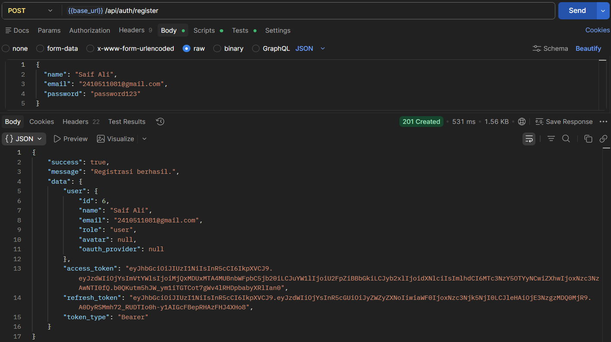 |
| Login | 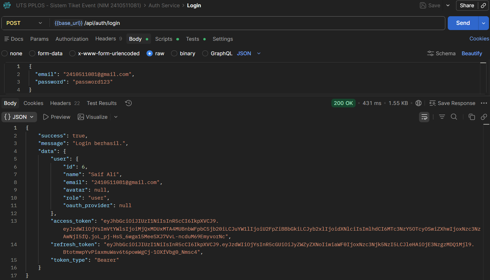 |
| Refresh Token | 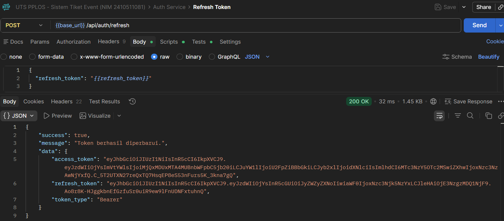 |
| Logout | 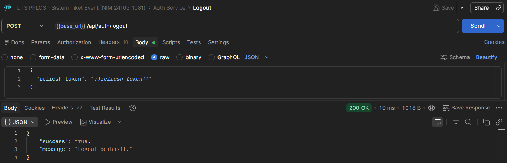 |
| Get Profile | 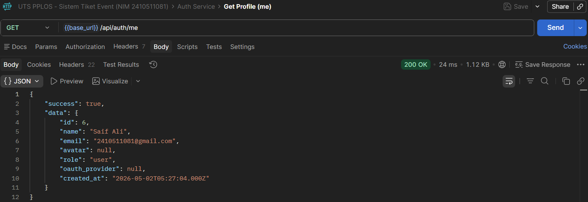 |
| GitHub OAuth | 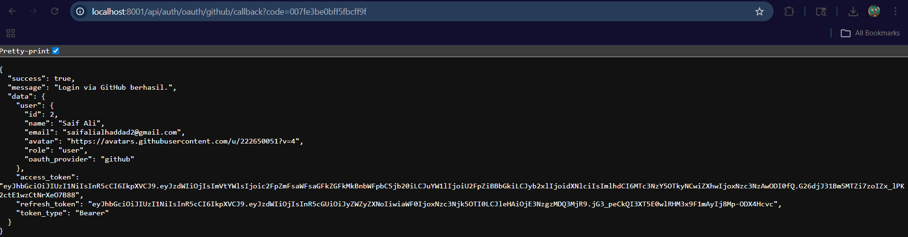 |

### Event Service
| Endpoint | Screenshot |
|---|---|
| List Events | 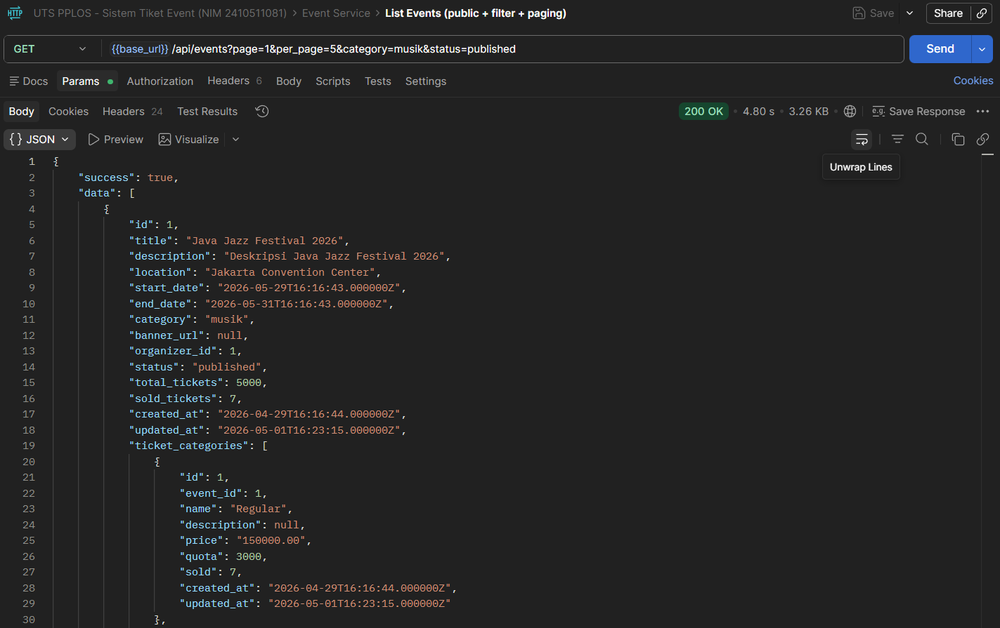 |
| Event Detail | 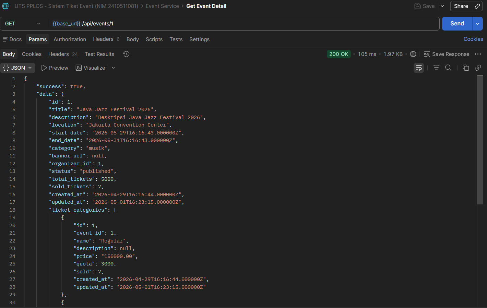 |
| Ticket Categories | 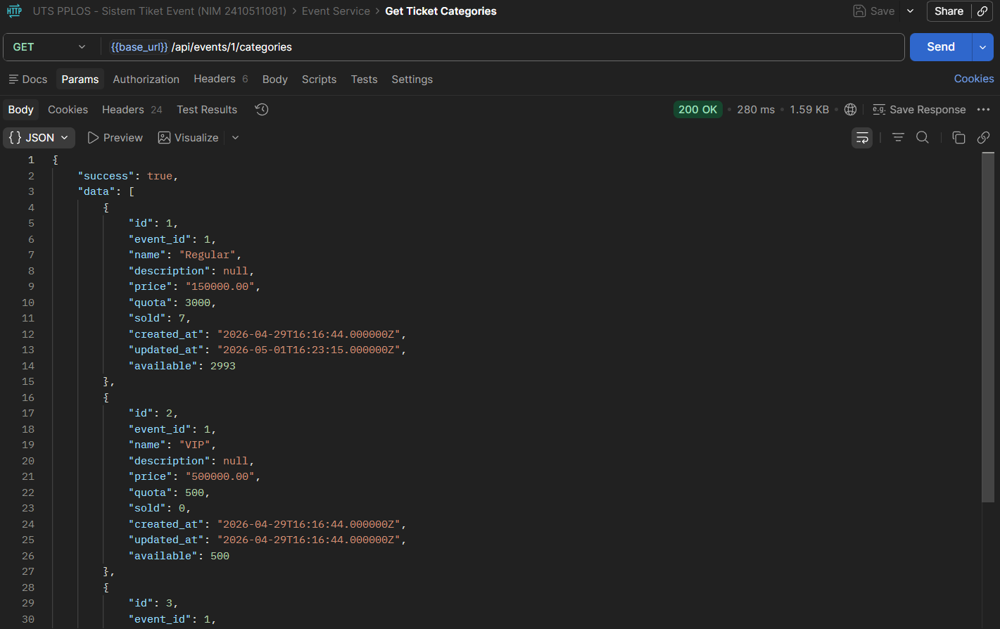 |
| Create Event | 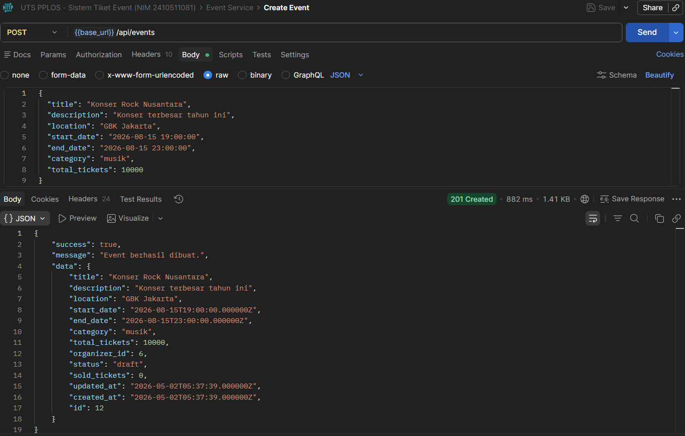 |
| Update Event | 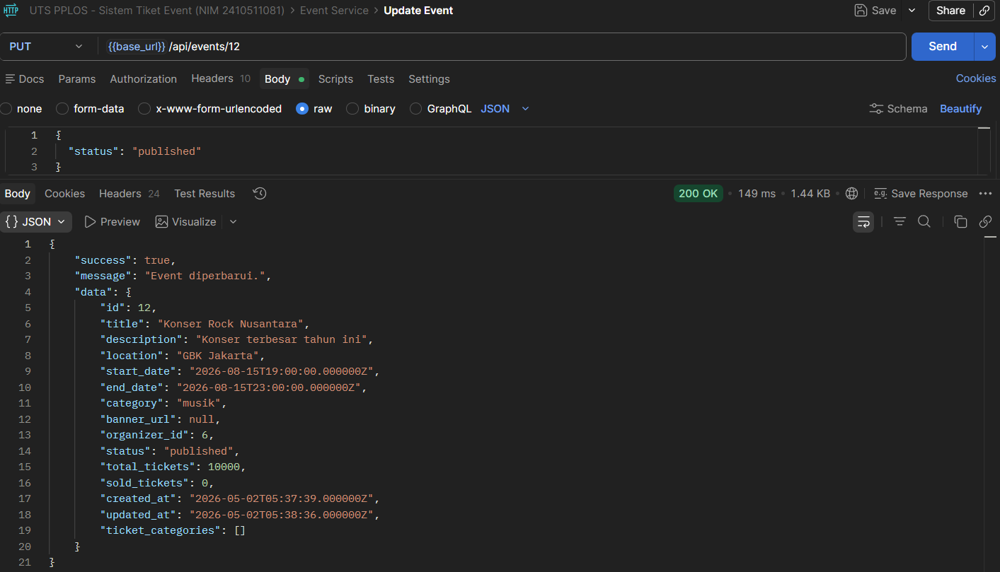 |
| Delete Event | 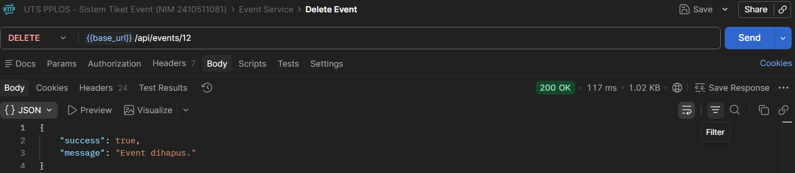 |

### Order Service
| Endpoint | Screenshot |
|---|---|
| Checkout Order | 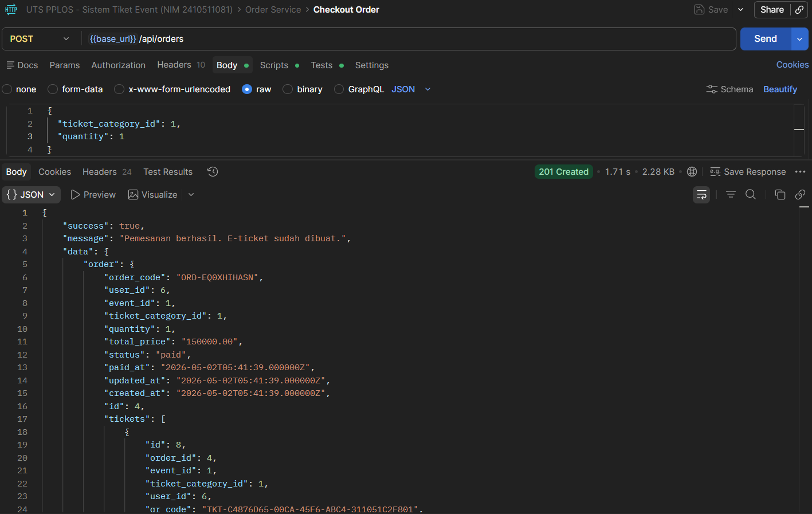 |
| My Orders | 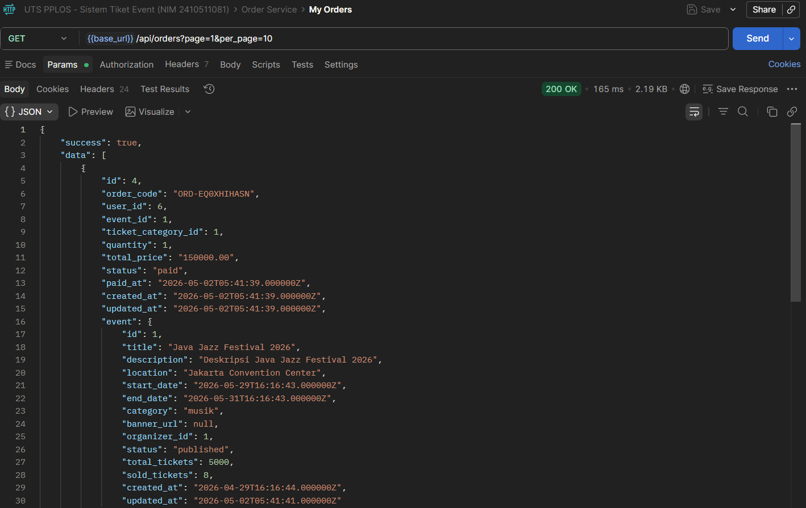 |
| Order Detail | 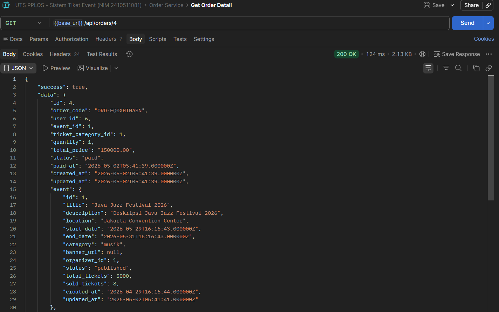 |

### Ticket Service
| Endpoint | Screenshot |
|---|---|
| Validate Ticket (200) | 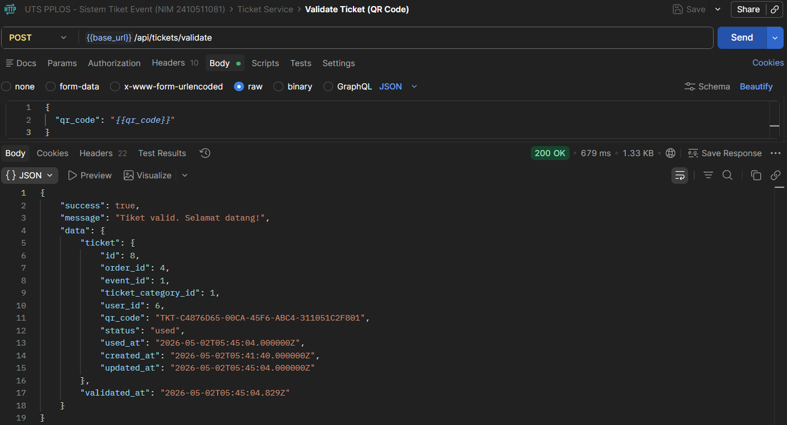 |
| Already Used (409) | 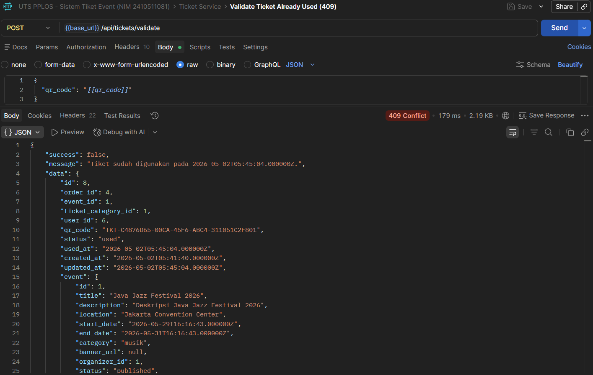 |
| Not Found (404) | 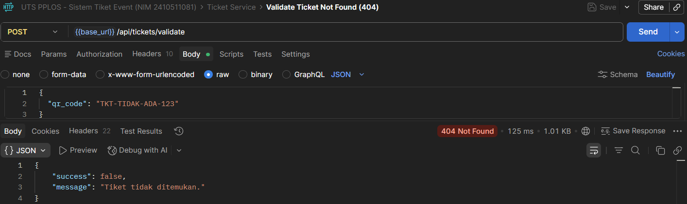 |
| Ticket Detail | 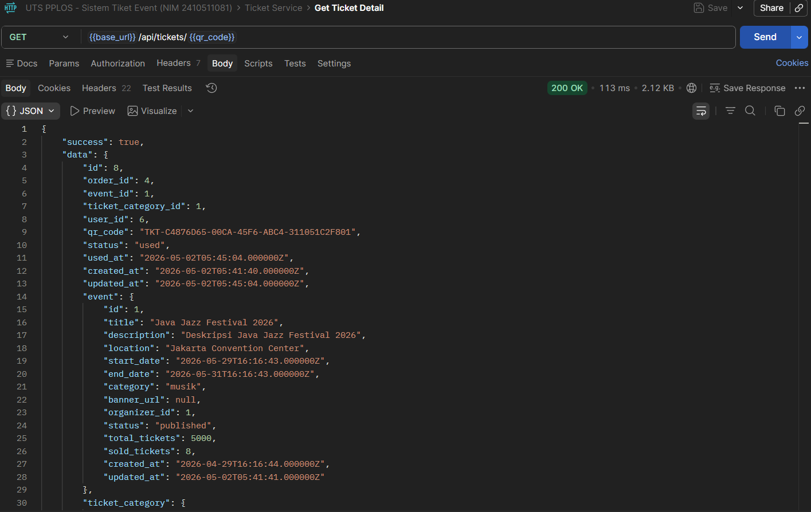 |
| Validation History | 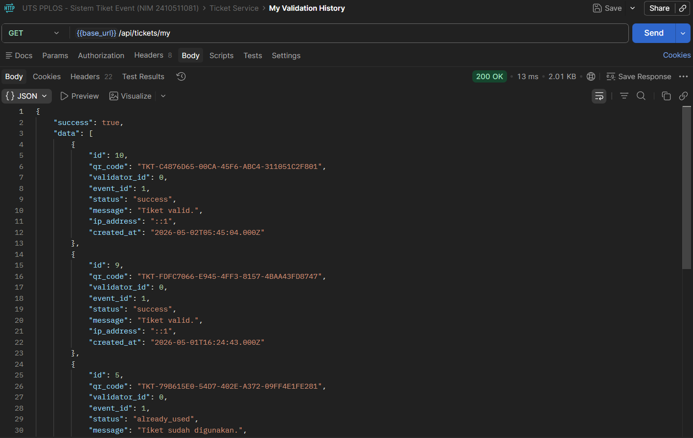 |

---

## Struktur Repository

```
uts-pplos-b-2410511081/
├── README.md
├── gateway/
│   ├── index.js
│   ├── middleware/
│   │   ├── jwtMiddleware.js
│   │   └── rateLimiter.js
│   └── package.json
├── services/
│   ├── auth-service/          # Node.js — JWT + GitHub OAuth
│   │   ├── controllers/
│   │   ├── models/
│   │   ├── middleware/
│   │   ├── routes/
│   │   ├── services/
│   │   ├── config/
│   │   ├── migrate.js
│   │   └── index.js
│   ├── event-service/         # Laravel 11 MVC
│   │   ├── app/
│   │   │   ├── Http/Controllers/
│   │   │   ├── Models/
│   │   │   └── Services/
│   │   └── database/migrations/
│   └── ticket-service/        # Node.js — Validasi QR
│       ├── controllers/
│       ├── models/
│       ├── routes/
│       ├── services/
│       ├── config/
│       ├── migrate.js
│       └── index.js
├── docs/
│   ├── laporan-uts.pdf
│   └── arsitektur.png
└── postman/
    └── collection.json
```

---

## Demo Video

[https://youtu.be/uoReJrgGg2o]